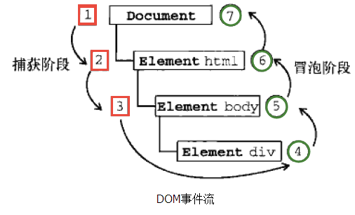
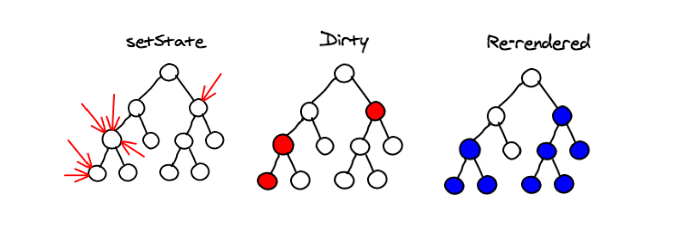
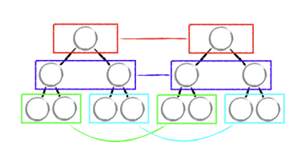
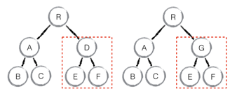
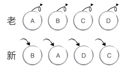
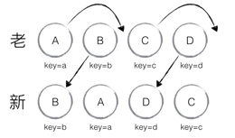

# React 入门

（上）

Note:

## 课程对象

Web 前端校招生 P1-3

## 内容介绍

面向了解前端开发的研发同学，介绍如何使用 React 开发前端页面。

课程包含示例代码，可以在课程最后的相关资料中获取仓库地址。在编辑器中打开，启动本地开发服务器，就可以看到运行的效果。

---

- React 简介
- JSX
- 组件
- 事件
- State
- 生命周期
- 重绘流程

Note:

课程包含上下两部分，上半部分包括如下章节。

----

## React 简介

- 声明式
- 组件化
- 跨平台

---

```js
<CommentList comments={comments} />
```

Note:

声明式的书写方式。通过 JSX 轻松管理和书写标签，属性和嵌套。
通过组件化，把自定义组件，把模版，样式和逻辑封装在一起。

---

```html
<!DOCTYPE html>
<html>
  <head>
    React Hello World
  </head>
  <body>
    <div id="root"></div>
    <script src="https://static.meituan.net/bs/react/16/umd/react.production.min.js"></script>
    <script src="https://static.meituan.net/bs/react-dom/16/umd/react-dom.production.min.js"></script>
    <script>
      ReactDOM.render(
        React.createElement('h1', null, 'Hello, world!'),
        document.getElementById('root')
      );
    </script>
  </body>
</html>
```

Note:

其中 react.js 是核心逻辑。
react-dom.js 是针对 web 端的适配，通过替换这个文件，可以实现跨平台的特性。比如 react-native 是适用于 Android 和 iOS 的等。
通过 react-dom 的 `render` 方法挂载到 `#root` 节点上。
例子：01.HelloWorld.js

----

# JSX

```js
const element = <p className="comment">Hello, world!</p>;
```

Note:

类似于在 js 中写 HTML。
JSX 的标签中可以使用 HTML 的标签，用小写开头的标签名称来表示；也可以使用自定义组件，用大写开头的标签名称来表示。
最外层只能有一个节点。标签需要闭合。

---


Note:

通过虚拟 DOM 的方式解决了浏览器渲染的性能问题。

---

# ES5

```js
// <p className="comment">Hello, world!</p>
const element = React.createElement(
  'p',
  {
    className: 'comment',
  },
  'Hello, world!'
);
```

---

# 引入 React

```js
import React from 'react';
```

Note:

在使用到了 JSX 的文件中需要引入 React。

---

# 虚拟 DOM

```js
// <p className="comment">Hello, world!</p>
const element = {
  type: 'p',
  props: {
    className: 'comment',
    children: 'Hello, world',
  },
};
```

---

# 使用变量

```js
// ok
const element = <p>{`This is a comment: ${comment}`}</p>;
```

```js
// better
const element = <p>This is a comment: {comment}</p>;
```

Note:

字符串拼接时使用后者更简洁。
例子：02.UsingVariable.js

---

# 使用属性 (props)

```js
const element = ;
```

Note:

属性都是小写开头的驼峰式。
HTML 标签上的属性必须符合 HTML 规范；自定义组件上的属性可以自定义属性名称。
例子：03.UsingProps.js

---

```js
// ok
const element = ;
```

```js
// better
const element = ;
```

Note:

属性中的字符串通过双引号传递更简洁。

---

```js
// ok
const element = <button disabled={true}>提交</button>;
```

```js
// better
const element = <button disabled>提交</button>;
```

Note:

属性为 `true` 时省略，更简洁。

---

```js
const element = ;
```

Note:

style 中的数据是一个对象。

---

# 嵌套

```js
const element = (
  <p>
    
    <span>Hello World!</span>
  </p>
);
```

Note:

例子：04.NestingComponents.js

---

# 列表和 key

```js
const commentElements = comments.map(({ id, comment }) => {
  return <li key={id}>{comment}</li>;
});

const element = <ul>{commentElements}</ul>;
```

Note:

循环 JSX 标签的时候要用 key，key 必须和数据一一对应。
key 可以在元素被增加或删除的时候帮助 React 识别哪些元素发生了变化
最好用数据的 id 值作为 key，也可以用索引值，但是索引值在重排的情况下会导致渲染变慢
例子：05.ListAndKeys.js

---

# 有条件的渲染

```js
// ok
const element = commentData.isBlocked ? null : <Comment />;
```

```js
// better
const element = commentData.isBlocked || <Comment />;
```

Note:

例子：06.ConditionalRendering.js

---

- `false`
- `null`
- `undefined`
- `true`

Note:

节点是 `false`, `null`, `undefined`, `true` 的，都会被当作空元素渲染。

---

# 空标签

```js
// ok
<Tag></Tag>
```

```js
// better
<Tag />
```

---

# 注释

```js
const element = <div>{/* This is a comment */}</div>;
```

Note:

例子：07.Comment.js

---

# HTML 转义

```js
const element = (
  <div dangerouslySetInnerHTML={{ __html: '<span>Text</span>' }} />
);
```

Note:

例子：08.HTMLEscape.js  

----

# 组件

---

# 自定义组件

- 类声明组件
- 函数式组件

Note:

通过自定义组件实现了拆分和复用。
两种方式声明自定义组件。

---

# 类声明组件

```js
class Comment extends Component {
  state = {
    clicked: false,
  };

  render() {
    const { comment } = this.props;
    return <li>{comment}</li>;
  }
}
```

Note:

最常用的一种写法。
在标签中使用自定义组件的变量名称必须是大写的。
可以添加内部的状态管理。
例子：09.ClassComponents.js

---

# 函数式组件

```js
function Comment({ comment }) {
  return <li>{comment}</li>;
}

const element = (
  <ul>
    {comments.map(({ id, comment }) => {
      return <Comment key={id} comment={comment} />;
    })}
  </ul>
);
```

Note:

没有内部状态管理等，不能使用 state、context 等能力。
例子：10.FunctionalComponents.js

---

# 函数式组件

```js
import React, { useState } from 'react';

export default function UsingHooks() {
  const [count, setCount] = useState(0);

  return (
    <div>
      <p>You clicked {count} times</p>
      <button onClick={() => setCount(count + 1)}>Click me</button>
    </div>
  );
}
```

Note:

v16.8 及以后的版本，可以通过 hooks 支持到。
例子：11.UsingHooks.js

---

### v0.14 版本之前

```js
const Comment = React.createClass({
  render() {
    const { comment } = this.props;
    return <li>{comment}</li>;
  },
});
```

---

# Fragments

组件返回一个节点列表

```js
render() {
  return (
    <React.Fragment>
      <li>Comment one.</li>
      <li>Comment two.</li>
    </React.Fragment>
  );
}
```

Note:

例子：12.Fragment.js

---

# 动态的组件类型

```js
function getCommentType(commentData) {
  if (commentData.isVIP) {
    return VIPComment;
  }
  return Comment;
}

const CommentType = getCommentType(commentData);

const element = <CommentType comment={comment} />;
```

Note:

在用到自定义组件的时候同样需要遵守变量名称大写的规定。
例子：13.RuntimeComponentTypes.js

----

# 事件

React 基于虚拟 DOM 实现了合成事件

Note:

实现了 W3C 规范，不用担心浏览器兼容问题。

---

# 事件模型

- 事件冒泡
- 事件委托



Note:

事件开始从最具体的元素到 document 逐级传播
利用了事件冒泡特性，只需要指定一个事件处理程序，根据 target.id 来识别是被触发元素
好处：减少事件绑定导致的内存占用

---

# 绑定方式

```js
const handleClick = (e) => {
  // 浏览器标准事件
};
<button onClick={handleClick}>提交</button>;
```

Note:

事件通过 props 属性的方式绑定在 JSX 的组件上。
事件的属性是小写开头的驼峰式的，比如：`onClick`。
回调函数中可以获取参数，和浏览器标准是一致的。

---

# this 的指向

```js
class Submit extends Component {
  isSubmitting = false;

  handleClick(event) {
    // throws TypeError: Cannot read property 'isSubmitting' of null
    console.log(this.isSubmitting);
  }

  render() {
    return <button onClick={this.handleClick}>提交</button>;
  }
}
```

Note:

事件回调中使用了 `this` 的话，需要绑定。

---

```js
class Submit extends Component {
  isSubmitting = false;

  constructor(props) {
    super(props);
    this.handleClick = this.handleClick.bind(this);
  }

  handleClick() {
    console.log(this.isSubmitting);
  }

  render() {
    return <button onClick={this.handleClick}>提交</button>;
  }
}
```

Note:

例子：14.BindingEvents.js

----

# State

- 定义 State

---

```js
class Submit extends Component {
  state = {
    isSubmitting: false,
  };

  render() {
    const { isSubmitting } = this.state;
    return <button disabled={isSubmitting}>提交</button>;
  }
}
```

---

```js
class Submit extends Component {
  constructor(props) {
    super(props);
    this.state = {
      isSubmitting: props.isSubmitting,
    };
  }

  render() {
    const { isSubmitting } = this.state;
    return <button disabled={isSubmitting}>submit</button>;
  }
}
```

---

# 修改 State

```js
// never do this
this.state = newState;
```

```js
this.setState(newState);
```

Note:

React 并不监听变量的变更，只有通过 `setState` 才可以让组件重新渲染。
不要在 `shouldComponentUpdate` 和 `componentWillUpdate` 调用 `setState`，避免造成循环调用。
例子：16.UpdatingState.js

---

### State 的更新是异步的

```js
this.setState({ isSubmitting: true });
if (comment.isBlocked) {
  this.setState({ buttonDisabled: false });
}
```

Note:

多次 `setState` 会被合并到一个任务中完成 State 的更新。
在 `setState` 后获取 State 是不可以拿到最新的 State 的。
例子：17.AsynchronousStateUpdating.js

---

# 数据流


Note:

- 无状态组件不包含 State
- setState 后更新 State，重新渲染组件
- 父级组件通过 Props 将 State 数据和可以操作 State 的回调函数传递给子组件。
- 子组件可以用到 Props 和 State。
- 组件内可以修改 State，不能修改 Props。
- 更深层级的嵌套关系需要一层层传递数据和回调。

---

```js
class App extends Component {
  state = {
    loading: true,
    isSubmitting: false,
    comments: [],
    newComment: '',
  }

  render() {
    const { loading, isSubmitting, comments, newComment } = this.state;
    return (
      <div>
        <CommentList comments={comments} />
        <CommentForm
          newComment={newComment}
          isSubmitting={isSubmitting}
        />
      </div>
    );
  }
}
```

---

```js
function CommentList({ comments }) {
  return comments.map(({ id, avatarURL, comment }) => {
    return <Comment key={id} avatarURL={avatarURL} comment={comment} />
  });
}

function Comment({ avatarURL, comment }) {
  return (
    <p>
      
      <span className="comment">{comment}</span>
    </p>
  )
}
```

----

# 生命周期

---

<iframe style="width: 1200px; height: 800px;" src="./assets/react-lifecycle-methods-diagram.html"></iframe>

Note:

例子：18.Lifecycle.js

无状态组件没有生命周期

---

### v16.3 版本之前 <!-- .element: style="top: 7%; position: relative;" -->

<iframe style="width: 1200px; height: 800px; position: relative; top: 4%;" src="./assets/react-lifecycle-methods-diagram-legacy.html"></iframe>

Note:

例子：19.LegacyLifecycle.js

----

# 重绘流程

---



Note:

多次 `setState` 会合并到一次操作。

React 虚拟 DOM 的生成是全量的，每次渲染会执行顶层组件的 `render` 方法，一层一层 `render` 下来，最终产生完整的虚拟 DOM。因此父组件的 `render` 会导致子组件的 `render` 执行。

---


Note:

通过 `ReactDOM.render` 挂载的方式渲染到 HTML 的 DOM 上。
React 对重复执行渲染进行了优化，采用虚拟 DOM 的技术做到了 HTML 的节点变化时才更新。解决了 HTML DOM 慢的问题。

---

## DOM Diff 的三个假设

- DOM 节点跨层级的移动操作特别少，可以忽略不计。
- 两个相同组件产生类似的 DOM 结构，不同的组件产生不同的 DOM 结构。
- 对于同一层次的一组子节点，它们可以通过唯一的 ID 进行区分。

---

# Tree Diff



Note:

- 对树进行分层比较，两棵树只会对同一层次的节点进行比较。
- 对树进行一次遍历，便能完成整个 DOM 树的比较。

React 通过 `updateDepth` 对 Virtual DOM 树进行层级控制，只会对相同颜色方框内的 DOM 节点进行比较，即同一个父节点下的所有子节点。当发现节点已经不存在，则该节点及其子节点会被完全删除掉，不会用于进一步的比较
在开发组件时，保持稳定的 DOM 结构会有助于性能的提升。例如，可以通过 CSS 隐藏或显示节点，而不是真的移除或添加 DOM 节点。

---

# Component Diff



Note:

- 同一类型的组件，按照 Tree Diff 策略继续比较。
- 不同类型组件，替换整个组件下的所有子节点。

通过 `shouldComponentUpdate` 来判断该组件是否需要进行 diff，减少同类型组件比较。

---

# List Diff




Note:

- 对列表节点，添加唯一 key 进行区分，可以大大减少比对。

---

# 更新 DOM

- 更新队列：保存上面对比出来的差异
- 批量更新：遍历更新队列，逐个操作对应 DOM
