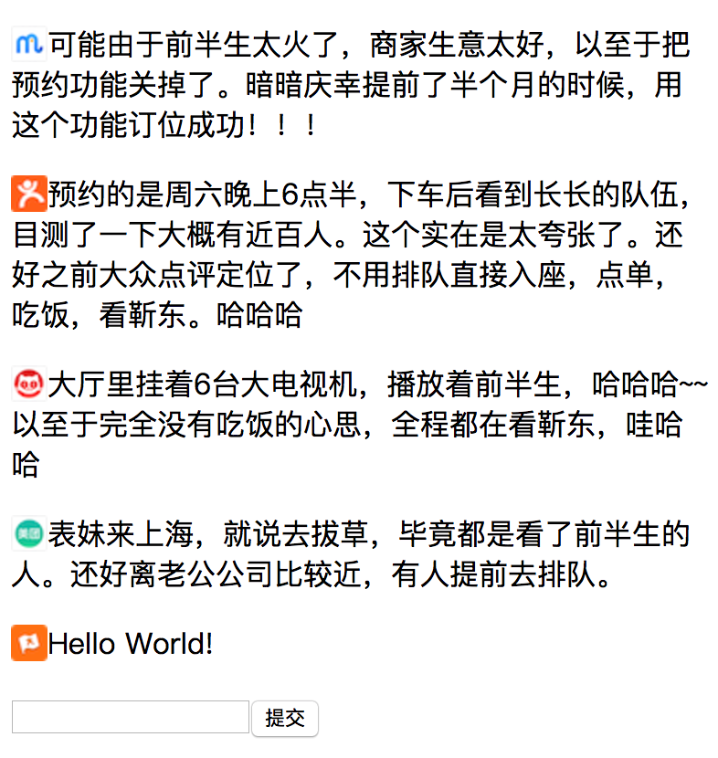
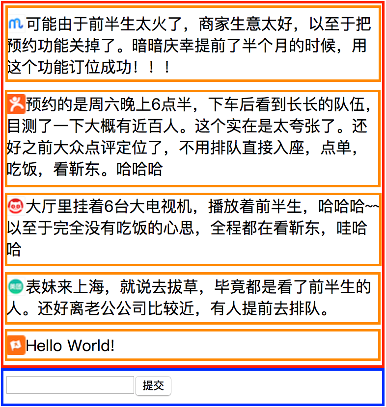

# React 入门

（下）

---

- PropTypes
- Refs
- Context
- Portals
- 受控组件和非受控组件
- 用 React 的方式思考

Note:

下半部分包括如下章节

----

# PropTypes

检验传入组件的属性

---

```js
import React, { Component } from 'react';
import PropTypes from 'prop-types';

export default class PropTypesComponent extends Component {
  static propTypes = {
    comment: PropTypes.string.isRequired,
    avatarURL: PropTypes.string,
  };

  static defaultProps = { avatarURL };

  render() {
    const { comment, avatarURL } = this.props;
    return (
      <p>
        
        <span className="comment">{comment}</span>
      </p>
    );
  }
}
```

Note:

例子：20.PropTypesComponent.js

---

```js
import PropTypes from 'prop-types';

MyComponent.propTypes = {
  // You can declare that a prop is a specific JS primitive. By default, these
  // are all optional.
  optionalArray: PropTypes.array,
  optionalBool: PropTypes.bool,
  optionalFunc: PropTypes.func,
  optionalNumber: PropTypes.number,
  optionalObject: PropTypes.object,
  optionalString: PropTypes.string,
  optionalSymbol: PropTypes.symbol,

  // Anything that can be rendered: numbers, strings, elements or an array
  // (or fragment) containing these types.
  optionalNode: PropTypes.node,

  // A React element.
  optionalElement: PropTypes.element,

  // You can also declare that a prop is an instance of a class. This uses
  // JS's instanceof operator.
  optionalMessage: PropTypes.instanceOf(Message),

  // You can ensure that your prop is limited to specific values by treating
  // it as an enum.
  optionalEnum: PropTypes.oneOf(['News', 'Photos']),

  // An object that could be one of many types
  optionalUnion: PropTypes.oneOfType([
    PropTypes.string,
    PropTypes.number,
    PropTypes.instanceOf(Message),
  ]),

  // An array of a certain type
  optionalArrayOf: PropTypes.arrayOf(PropTypes.number),

  // An object with property values of a certain type
  optionalObjectOf: PropTypes.objectOf(PropTypes.number),

  // An object taking on a particular shape
  optionalObjectWithShape: PropTypes.shape({
    color: PropTypes.string,
    fontSize: PropTypes.number,
  }),

  // You can chain any of the above with `isRequired` to make sure a warning
  // is shown if the prop isn't provided.
  requiredFunc: PropTypes.func.isRequired,

  // A value of any data type
  requiredAny: PropTypes.any.isRequired,

  // You can also specify a custom validator. It should return an Error
  // object if the validation fails. Don't `console.warn` or throw, as this
  // won't work inside `oneOfType`.
  customProp: function(props, propName, componentName) {
    if (!/matchme/.test(props[propName])) {
      return new Error(
        'Invalid prop `' +
          propName +
          '` supplied to' +
          ' `' +
          componentName +
          '`. Validation failed.'
      );
    }
  },

  // You can also supply a custom validator to `arrayOf` and `objectOf`.
  // It should return an Error object if the validation fails. The validator
  // will be called for each key in the array or object. The first two
  // arguments of the validator are the array or object itself, and the
  // current item's key.
  customArrayProp: PropTypes.arrayOf(function(
    propValue,
    key,
    componentName,
    location,
    propFullName
  ) {
    if (!/matchme/.test(propValue[key])) {
      return new Error(
        'Invalid prop `' +
          propFullName +
          '` supplied to' +
          ' `' +
          componentName +
          '`. Validation failed.'
      );
    }
  }),
};
```

----

# Refs

获取 React 对象实例的方法

Note:

为了解决虚拟 DOM 的情况下，直接获取 DOM 进行操作的情况，引入了 ref 的概念。

不常用。只是在输入框聚焦，文字选择，video 播放，动画控制、DOM 大小计算等场景下使用。或者配合第三方库时使用。

比如弹窗的打开和关闭可以通过 `isOpen` 属性来控制，而不是通过提供 `open`，`close` 等方法来操作。

---

## Refs 获取原生 DOM 实例

```js
class CustomInput extends Component {
  constructor(props) {
    super(props);
    this.inputRef = React.createRef();
    this.focusInput = this.focusInput.bind(this);
  }

  focusInput() {
    this.inputRef.current.focus();
  }

  render() {
    return (
      <div>
        <input ref={this.inputRef} />
        <button onClick={this.focusInput}>聚焦</button>
      </div>
    );
  }
}
```

Note:

例子：21.RefDOMComponent.js

---

## Refs 获取 React 类的实例

```js
class CustomInput extends Component {
  focusInput() {
    // ...
  }

  render() {
    // ...
  }
}

class RefReactComponent extends Component {
  constructor(props) {
    super(props);
    this.inputRef = React.createRef();
  }

  componentDidMount() {
    this.inputRef.current.focusInput();
  }

  render() {
    return <CustomInput ref={this.inputRef} />;
  }
}
```

Note:

获取到的 `customInput` 是 `CustomInput` 类的一个实例。
例子：22.RefReactComponent.js

---

# ref 与生命周期

- 挂载
- 卸载

Note:

在挂载后可以使用 `ref.current`，卸载后无法使用。
例子：23.RefMount.js

---

### v16.3 之前的版本

```js
class CustomInput extends Component {
  constructor(props) {
    super(props);
    this.focusInput = this.focusInput.bind(this);
    this.setInputRef = this.setInputRef.bind(this);
  }

  focusInput() {
    this.inputRef.focus();
  }

  setInputRef(ref) {
    this.inputRef = ref;
  }

  render() {
    return (
      <div>
        <input ref={this.setInputRef} />
        <button onClick={this.focusInput}>聚焦</button>
      </div>
    );
  }
}
```

Note:

v16.3 之前的版本不支持 `React.createRef` API。
例子：24.CallbackRef.js

---

### v0.13 之前的版本

```js
class CustomInput extends Component {
  constructor(props) {
    super(props);
    this.focusInput = this.focusInput.bind(this);
  }

  focusInput() {
    this.refs.inputRef.focus();
  }

  render() {
    return (
      <div>
        <input ref="inputRef" />
        <button onClick={this.focusInput}>聚焦</button>
      </div>
    );
  }
}
```

Note:

v0.13 之前的版本不支持在 `ref` 属性中使用回调。
例子：25.StringRef.js

----

# Context

跨级传递数据

Note:

- 用途：常用在共享全局数据，如登录的用户信息、主题、语言等。
- 缺点：子组件耦合 context 逻辑，难以复用。

---

## 通过 contextType 使用 context

```js
// 1. 使用 React.createContext 创建 context，定义数据结构，并传入默认值
const ThemeContext = React.createContext('light');

function App() {
  // 2. 使用 ThemeContext.Provider 为子组件提供 context
  return (
    <ThemeContext.Provider value="dark">
      <StyledComponent />
    </ThemeContext.Provider>
  );
}

class StyledComponent extends Component {
  // 3. 在需要使用 context 的子组件中，定义 contextType
  static contextType = ThemeContext;

  render() {
    // 4. 通过 this.context 来获取 context 的值
    return <p>Theme: {this.context}</p>;
  }
}
```

Note:

例子：26.ContextType.js

---

### 通过 Context.Consumer 使用 context

```js
// 1. 使用 React.createContext 创建 context，定义数据结构，并传入默认值
const ThemeContext = React.createContext('light');

function App() {
  // 2. 使用 ThemeContext.Provider 为子组件提供 context
  return (
    <ThemeContext.Provider value="dark">
      <StyledComponent />
    </ThemeContext.Provider>
  );
}

function StyledComponent() {
  return (
    // 3. 通过 Context.Consumer 的回调函数获取 context 的值
    <ThemeContext.Consumer>
      {(value) => <p>Theme: {value}</p>}
    </ThemeContext.Consumer>
  );
}
```

Note:

例子：27.ContextConsumer.js

---

### v16.3 之前的版本

```js
export default class LegacyContextType extends Component {
  // 1. 定义 context 的数据结构
  static childContextTypes = {
    theme: PropTypes.string.isRequired,
  };

  // 2. 设置 context 的值
  getChildContext() {
    return { theme: 'dark' };
  }
  // ...
}

class StyledComponent extends Component {
  // 3. 在需要使用 context 的子组件中，定义 contextType
  static contextTypes = {
    theme: PropTypes.string.isRequired,
  };

  render() {
    const { theme } = this.context;
    // 4. 通过 this.context 来获取 context 的值
    return <p>Theme: {theme}</p>;
  }
}
```

Note:

例子：28.LegacyContextType.js

---

# 更新 Context

```js
// 1. 定义 ThemeContext 数据格式，包括更新函数
const ThemeContext = React.createContext({
  theme: 'light',
  updateTheme: () => {},
});
```

---

```js
class UpdatingContext extends Component {
  // 2. 在根组件的 state 上声明 context 的值
  state = {
    theme: 'light',
  };

  render() {
    // 3. 组装 context，传入更新函数
    const contextValue = {
      theme: this.state.theme,
      updateTheme: this.updateTheme,
    };
    return (
      <ThemeContext.Provider value={contextValue}>
        <StyledComponent />
      </ThemeContext.Provider>
    );
  }
}
```

---

```js
render() {
  const { inputValue } = this.state;
  // 4. 使用 Context.Consumer 获取 context 的值，通过更新函数更新 context
  return (
    <ThemeContext.Consumer>
      {({ theme, updateTheme }) => (
        <div>
          <p>Current theme: {theme}</p>
          <input value={inputValue} onChange={this.handleInputChange} />
          <button onClick={() => updateTheme(inputValue)}>更新主题</button>
        </div>
      )}
    </ThemeContext.Consumer>
  );
}
```

Note:

例子：29.UpdatingContext.js

----

# Portals

将 React 组件渲染到根节点之外的的节点上，用在弹窗等场景下。

```js
function Modal(props) {
  return ReactDOM.createPortal(props.children, domNode);
}
```

Note:

例子：30.UsingPortals.js

---

### Protals 事件冒泡

遵循 React 节点的包含关系

```js
<div onClick={this.handleClick}>
  <Modal>
    <button>弹窗内的按钮</button>
  </Modal>
</div>
```

Note:

button 的点击事件会触发 handleClick
例子：31.PortalsEventBubbling.js

----

# 受控组件

# 非受控组件

Note:

受控组件的数据保存于 React 组件。
非受控组件的数据保存于 DOM 元素。
推荐使用受控组件。

---

```js
class UncontrolledComponent extends Component {
  constructor(props) {
    super(props);
    this.inputRef = React.createRef();
    this.handleSubmit = this.handleSubmit.bind(this);
  }

  handleSubmit(e) {
    console.log(this.inputRef.current.value);
  }

  render() {
    return (
      <form onSubmit={this.handleSubmit}>
        <input ref={this.inputRef} defaultValue="默认值" />
        <input type="submit" value="提交" />
      </form>
    );
  }
}
```

Note:

例子：32.UncontrolledComponent.js

---

```js
class ControlledComponent extends Component {
  state = { value: '默认值' };

  constructor(props) {
    super(props);
    this.handleSubmit = this.handleSubmit.bind(this);
    this.handleChange = this.handleChange.bind(this);
  }

  handleSubmit() {
    console.log(this.state.value);
  }

  handleChange(e) {
    this.setState({ value: e.target.value });
  }

  render() {
    return (
      <form onSubmit={this.handleSubmit}>
        <input value={this.state.value} onChange={this.handleChange} />
        <input type="submit" value="提交" />
      </form>
    );
  }
}
```

Note:

例子：33.ControlledComponent.js

---

- 非受控组件：灵活

- 受控组件：同步

Note:

对于简单的功能，非受控组件的编写更方便。
受控组件有更好的数据流，自顶向下，便于理解。
受控组件有更好的可控性，如果要在外部设置数据，修改顶层的数据即可。
受控组件可以适用于实时校验，根据输入值同步禁用提交按钮的状态，格式化输入内容，同步多个输入框的内容等；然而非受控组件却很难这些功能。
https://goshakkk.name/controlled-vs-uncontrolled-inputs-react/

----

### 用 React 的方式思考

---

# 模块化

拆分相对独立的功能，进行封装。

---

# 数据驱动

 <!-- .element: style="width: 60%;" -->

Note:

不要直接操作 DOM，操作通过数据来体现在 DOM 上。

在设计数据的时候需要考虑到所有的状态。比如加载中，无数据，加载成功和加载失败。

总是提供默认数据，
通过默认数据来渲染初始状态，数据结构兼容所有状态。

如果有异步数据，则在组件挂载后再请求。

---

### 自顶向下逐级传递函数和数据

---

 <!-- .element: style="width: 50%;" -->

---

 <!-- .element: style="width: 50%;" -->

---

```js
class ThinkingInReact extends Component {
  state = {
    // 加载状态
    loading: true,
    isSubmitting: false,

    // 评论信息
    comments: [],
    newComment: '',
  }

  render() {
    const { loading, comments, newComment, isSubmitting } = this.state;
    if (loading) {
      return <Loading />;
    }
    return (
      <div>
        <CommentList comments={comments} />
        <CommentForm
          newComment={newComment}
          updateNewComment={this.updateNewComment}
          submitNewComment={this.submitNewComment}
          isSubmitting={isSubmitting}
        />
      </div>
    );
  }
}
```

---

```js
class ThinkingInReact extends Component {
  constructor(props) {
    super(props);
    this.updateNewComment = this.updateNewComment.bind(this);
    this.submitNewComment = this.submitNewComment.bind(this);
  }

  updateNewComment(value) {
    this.setState({ newComment: value });
  }

  async submitNewComment({ newComment }) {
    this.setState({ isSubmitting: true });
    const response = await fetch('./addComment.json');
    // ...
    this.setState({
      newComment: '',
      comments: newComments,
      isSubmitting: false,
    });
  }
}
```

---

```js
function CommentList(props) {
  const { comments } = props;
  return (
    <div>
      {comments.map((comment) => {
        return (
          <Comment
            key={comment.id}
            avatarURL={comment.avatarURL}
            comment={comment.comment}
          />
        );
      })}
    </div>
  );
}
```

---

```js
function Comment(props) {
  const { comment, avatarURL } = props;
  return (
    <p>
      
      <span className="comment">{comment}</span>
    </p>
  );
}
```

---

```js
function CommentForm(props) {
  const {
    isSubmitting,
    updateNewComment,
    submitNewComment,
    newComment,
  } = props;
  const handleChange = (e) => {
    updateNewComment(e.target.value);
  };
  const handleSubmit = () => {
    submitNewComment({ newComment });
  };
  return (
    <div>
      <input
        disabled={isSubmitting}
        type="text"
        value={newComment}
        onChange={handleChange}
      />
      <button disabled={isSubmitting} onClick={handleSubmit}>
        提交
      </button>
    </div>
  );
}
```

Note:

例子：34.ThinkingInReact

---

# 相关资料

- [课程源码](https://code.mws.sankuai.com/repository/projects/ADP/repos/train-react?mwsArea=sh)：https://code.mws.sankuai.com/repository/projects/ADP/repos/train-react?mwsArea=sh。
- [React 官方文档](https://reactjs.org/docs/hello-world.html) ：https://reactjs.org/docs/hello-world.html
- [《深入浅出React和Redux》](https://book.douban.com/subject/27033213/)：https://book.douban.com/subject/27033213/
